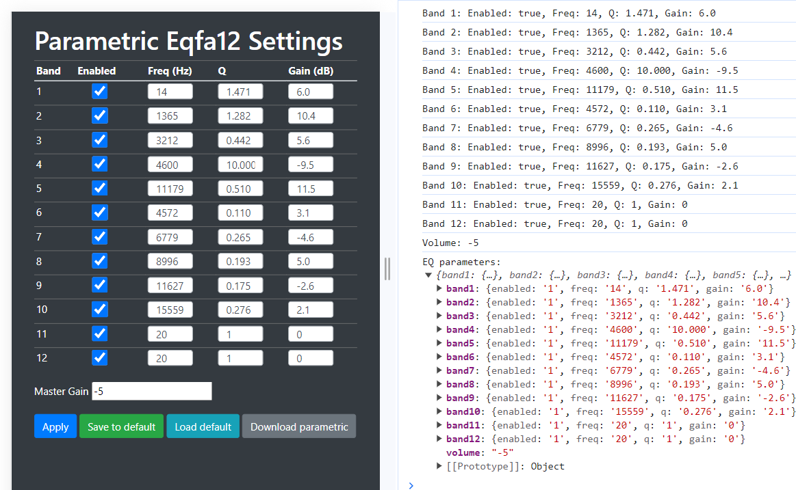

# 12 band Parametric EQ (Eqfa12p) for rAudio
>
EqFa12p a 3x4 bands parameteric EQ
>
Install
>
> wget -O - https://raw.githubusercontent.com/lovehifi/eqfa12/main/install.sh | sh
>
>

-----------
>
#### Use for MPD rAudio
Edit file /srv/http/data/mpdconf/mpd.conf
>
Add comment # this line, like this: 
>
> #include_optional    "output.conf"
>
And add this line:
>
> include_optional    "eq12.conf"
>
reboot
>
-----------
>
####  Use for SQ LMSrAudio
>
Change the output to **-o eqfa12p**, like this:
>
> /opt/sq/squeezelite64 -o eqfa12p -n SQ64-rAudio -s 127.0.0.1 -m 00:00:00:00:00:00 -W
>
reboot
>
-------
#### Install Eqfa12 for LMSrAudio
>
https://github.com/lovehifi/addraudio#4-eqfa12-lms
>
------------
#### Config Alsa for Eqfa12p
>
When you switch DACs, it's necessary to run this command to configure the /etc/alsa/conf.d/eqfa12p.conf file:
>
> /opt/eq.sh
>
------------
## Parametric Eqfa12 Settings page:
>
http://raudio/eqfa12 or http://ip/eqfa12
>

>

#### Build from Repo: 
> [https://github.com/bitkeeper/caps](https://github.com/bitkeeper/caps)
>
#### Information
> https://audiouniversityonline.com/parametric-eq-vs-graphic-eq/
>
> https://audiosolace.com/parametric-eq-vs-graphic-eq/
>
> https://www.bitlab.nl/page_id=540
>
> http://quitte.de/dsp/caps.html
>
> https://github.com/jaakkopasanen/AutoEq
>
> https://autoeq.app
> 
----------------------
## Graphic EQ vs. parametric EQ—what’s the difference?
Graphic EQ and Parametric EQ are two equalizer layouts that offer different methods of frequency control. Graphic EQ uses many narrow adjacent EQ bands to target specific frequencies, while parametric EQ allows the user to change the width of each band for broader adjustment.

**Graphic EQ** is typically used to notch out specific frequencies that are contributing to feedback in a live performance sound reinforcement system. Each band is represented by a slider that can be pushed up or down to boost or cut that frequency.

**Parametric EQ** is widely used in recording and mixing to change the character of a sound or emphasize certain qualities. Instead of sliders, parametric EQ uses traditional rotary knobs and switches to control several parameters that shape the EQ band. As I mentioned above, the most common ones are:

- Filter type (HPF, LPF, BPF, shelf, bell, notch)
- Q (bandwidth or ‘quality factor’)
- Frequency
- Gain
Some users find graphic EQ easier to learn at first since adjusting multiple bands creates a visual representation of the overall curve. This is the reason for the name ‘Graphic EQ.’

However, parametric EQ is much more flexible once you get used to it. On top of that, it provides specific advantages for guitar players.

Parametric EQ gives you access to a much wider range of shapes and curves using far fewer bands than graphic EQ.

For example, consider a shelving filter like the type you’ll find on the Empress ParaEQ MK II Deluxe.

Shelving filters are a basic EQ type for boosting or attenuating material above or below a corner frequency. They’re typically used to broadly adjust the highs or lows to taste. You can think of them like the treble and bass controls on a car stereo.

To approximate a shelving filter with a graphic EQ, you’d have to adjust every single band on the other side of the corner frequency.

That means that on a typical 31-band graphic EQ, you’d need to use five or more bands to approximate a shelving boost at 5 kHz!

Each slider has it’s own narrow range of action, so instead of a gentle sloping curve to a flat shelf, the overlapping edges of each band create noticeable peaks and troughs.
> Source: https://empresseffects.com/blogs/empress-blog/graphic-eq-vs-parametric-eq-the-guitarist-s-guide-to-equalizer-types
